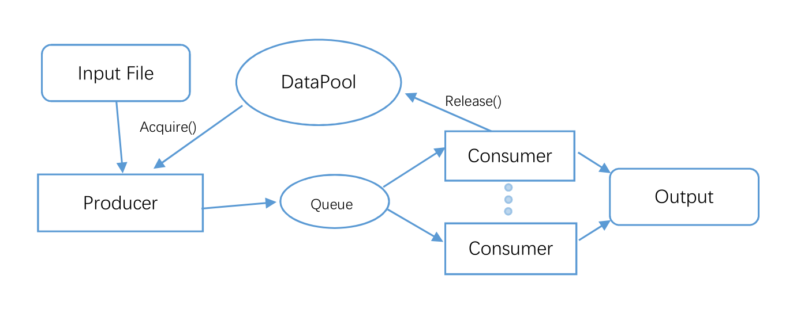

# RabbitFX: Efficient Framework for FASTA/Q File Parsing on Modern Multi-Core Platforms

## Installation
### Dependency
 1. c++11
 2. [zlib](https://zlib.net/)


### 1. Using Cmake
Copy folder io to your program, and then
you can integrate RabbitFX in your `CMakeLists.txt`:
```cmake
AUX_SOURCE_DIRECTORY(. SOURCE_LIST)
ADD_LIBRARY(rabbitfx ${SOURCE_LIST})
TARGET_LINK_LIBRAIES(rabbitfx z)
```
### 2. Using build libray
```
mkdir build
cmake .. -DCMAKE_INSTALL_PREFIX=/your/install/path
make && make install
g++ -std=c++11 YOURFILE.cpp -I/your/install/path/include -L/your/install/path/lib -lrabbitfx -lz -lpthread
```

### Build with libisal libray for processing gziped file faster
+ step1: install [ISA-L](https://github.com/intel/isa-l) 
+ step2: build RabbitFx
```
mkdir build
cmake .. -DCMAKE_INSTALL_PREFIX=/your/install/path -DIGZIP_PREFIX=/path/to/libisal
make && make install
g++ -std=c++11 YOURFILE.cpp -I/your/install/path/include -L/your/install/path/lib -lrabbitfx -lz -lpthread
```

## Highlight
 + RabbitFX highly support multi-core paltform
 + RabbitFX efficiency processing FASTQ/FASTA files
 + Concurrency data pool and data queue.
 + Non-copy read format
 + Bit-based sequencing processing

## Illustration

 

## Case study

- [RabbitFX-Ktrim](https://github.com/RabbitBio/RabbitFX-Casestudy/tree/master/RabbitFX-Ktrim)
- [RabbitFX-fastp](https://github.com/RabbitBio/RabbitFX-Casestudy/tree/master/RabbitFX-fastp)
- [RabbitFX-Mash](https://github.com/RabbitBio/RabbitFX-Casestudy/tree/master/RabbitFX-Mash)


## Document
Tutorial and reference documentation of RabbitFX are provided at [rabbitfx-doc.readthedocs.io](https://rabbitfx-doc.readthedocs.io/en/latest/index.html).

## Runing Example in main.cpp and TestCount.cpp

``` bash
cd RabbitFX
mkdir build && cd build
cmake ..
make
#then there is an test file in build file
time ./test
time ./testcount
```

**Note:** We integrated [CLI](https://github.com/CLIUtils/CLI11) as default command line patser.

## FASTQ data example

### Single-end data processing example

1. Example of defining a mult-threading task:

``` c++
int test_fastq_se(int argc, char** argv){
  std::string file = "/home/old_home/haoz/workspace/QC/out_1.fq";
  //---------------cmd parser----------------
  CLI::App app{"Wellcome to RabbitFX"};
  CLI::Option* opt;
  std::string filename ;
  int th;
  app.add_option("-f, --file", filename, "input file name")
    ->default_val(file);
  app.add_option("-t, --threads", th, "worktreads")
    ->default_val(2);
  //----------------------------------------
  CLI11_PARSE(app, argc, argv);
  if(app.count("-f"))
    std::cout << "filename: " << filename << std::endl;
  else{
    std::cout << "-f not find, use default: " << filename << std::endl;
  }
  rabbit::fq::FastqDataPool fastqPool(32, 1<<22);
  rabbit::core::TDataQueue<rabbit::fq::FastqDataChunk> queue1(64, 1);
  std::thread producer(producer_fastq_task, filename, std::ref(fastqPool), std::ref(queue1));
  std::vector<thread> threads;
  for(int t = 0; t < th; t++){
	threads.emplace_back(std::thread(consumer_fastq_task, std::ref(fastqPool), std::ref(queue1)));
  }
  producer.join();
  for(int t = 0; t < th; t++){
    threads[t].join();
  }
  return 0;
}
```
2. An example of defining producer and consumer tasks:
``` c++
int producer_fastq_task(std::string file, rabbit::fq::FastqDataPool& fastqPool, rabbit::core::TDataQueue<rabbit::fq::FastqDataChunk> &dq){
  rabbit::fq::FastqFileReader *fqFileReader;
  fqFileReader = new rabbit::fq::FastqFileReader(file, fastqPool);
  rabbit::int64 n_chunks = 0;
  while(true){
    rabbit::fq::FastqDataChunk* fqdatachunk;
    fqdatachunk = fqFileReader->readNextChunk();
    if (fqdatachunk == NULL) break;
    n_chunks++;
    //std::cout << "readed chunk: " << n_chunks << std::endl;
    dq.Push(n_chunks, fqdatachunk);
  }
  dq.SetCompleted();
  std::cout << "file " << file << " has " << n_chunks << " chunks" << std::endl;
  return 0;
}

void consumer_fastq_task(rabbit::fq::FastqDataPool& fastqPool, rabbit::core::TDataQueue<rabbit::fq::FastqDataChunk> &dq){
    long line_sum = 0;
    rabbit::int64 id = 0;
    std::vector<neoReference> data;
    rabbit::fq::FastqDataChunk* fqdatachunk;// = new rabbit::fq::FastqDataChunk;
    data.resize(10000);
    while(dq.Pop(id, fqdatachunk)){
      line_sum += rabbit::fq::chunkFormat(fqdatachunk, data, true);
      fastqPool.Release(fqdatachunk);
    }
    std::cout << "line_sum: " << line_sum << std::endl;
}

```

### Paired-end data processing example

An example of processing paired-end sequencing data is showed in file [TestCount.cpp](./TestCount.cpp).
It is tested that compared to [FQFeeder](https://github.com/rob-p/FQFeeder), in the task of counting ATCG of pair-end data, RabbitFX is 2 times faster in 20 thread.

RabbitFX is about 2G/s I/O speed now

## FASTA data example
This is an example of reading and processing FASTA files:

- example code of using only one thread (count chunk number of input file):
``` c++
int proces_fasta_task(std::string file) {
  rabbit::fa::FastaDataPool fastaPool(256, 1 << 22);
  rabbit::fa::FastaFileReader faFileReader(file, *fastaPool, false);
  int n_chunks = 0;
  int line_sum = 0;
  while (true) {
    rabbit::fa::FastaChunk *fachunk = faFileReader.readNextChunkList();
    if (fachunk == NULL) break;
    n_chunks++;
    //-----relaease
    rabbit::fa::FastaDataChunk *tmp = fachunk->chunk;
    do {
      fastaPool->Release(tmp);
      tmp = tmp->next;
    } while (tmp != NULL);
    // line_sum += rabbit::fa::chunkFormat(*fachunk, data);
  }
  std::cout << "file " << file << " has " << line_sum << " lines" << std::endl;
  return 0;
}

int test_fasta(int argc, char** argv){
  producer_fasta_task("/home/old_home/haoz/workspace/data/hg19/hg19.fa");
  return 0;
}
```

## Cite

RabbitFX paper is under review now.

